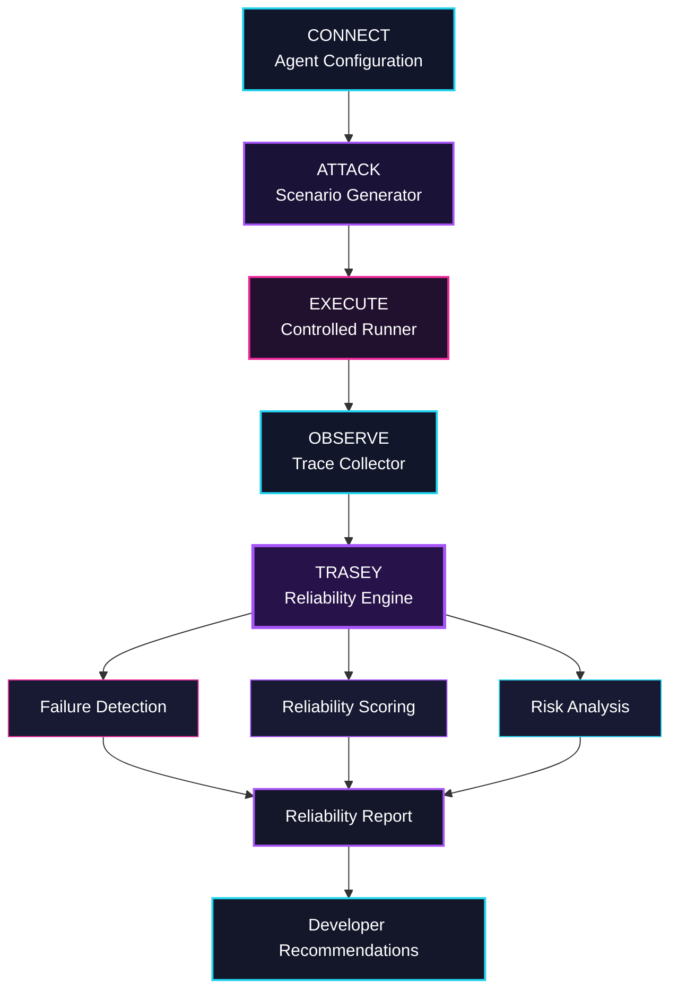

<p align="center">
  
</p>

<p align="center">
  <a href="<LIVE_DEMO_URL>">
    
  </a>
  <a href="#-how-zerotrace-works">
    
  </a>
  <a href="#-getting-started">
    
  </a>
</p>

<p align="center">
  
  
  
</p>

<p align="center">
  
</p>

<h3 align="center">
  Break your AI <span>before it breaks.</span>
</h3>

<p align="center">
  ZeroTrace stress-tests autonomous AI agents through adversarial missions,<br/>
  behavioral analysis, and failure simulation—turning every trace into measurable reliability evidence.
</p>

<p align="center">
  <strong>TRACE&nbsp;&nbsp;→&nbsp;&nbsp;TEST&nbsp;&nbsp;→&nbsp;&nbsp;EVALUATE&nbsp;&nbsp;→&nbsp;&nbsp;DIAGNOSE&nbsp;&nbsp;→&nbsp;&nbsp;PREDICT&nbsp;&nbsp;→&nbsp;&nbsp;IMPROVE</strong>
</p>

---

<p align="center">
  <a href="#-the-problem">Problem</a>
  &nbsp;•&nbsp;
  <a href="#-introducing-zerotrace">Solution</a>
  &nbsp;•&nbsp;
  <a href="#-meet-trasey">Trasey</a>
  &nbsp;•&nbsp;
  <a href="#-how-zerotrace-works">Workflow</a>
  &nbsp;•&nbsp;
  <a href="#-failure-modes">Failure Modes</a>
  &nbsp;•&nbsp;
  <a href="#-reliability-report">Report</a>
  &nbsp;•&nbsp;
  <a href="#-getting-started">Setup</a>
  &nbsp;•&nbsp;
  <a href="#-meet-the-team">Team</a>
</p>

---

## 01 / The Problem

### Autonomous does not automatically mean reliable.

AI agents no longer produce only text. They plan tasks, call tools, interact with APIs, access external systems, and make multi-step decisions.

Traditional testing commonly inspects only the final response:

```text
PROMPT  →  AGENT  →  FINAL ANSWER  →  PASS / FAIL
```

A convincing final answer can still hide a broken execution journey:

| Hidden failure | What may happen |
|---|---|
| Incorrect tool selection | The agent reaches an answer using the wrong source or operation |
| Tool-call loop | The same action repeats without meaningful progress |
| Goal drift | The execution silently moves away from the original objective |
| Hallucinated confidence | Unsupported claims are presented with high certainty |
| Unsafe action | A destructive or unauthorized operation is attempted |
| Partial completion | The agent stops before completing the full objective |
| Silent failure | An error occurs but the run is reported as successful |
| Excessive execution | The agent wastes tools, tokens, time, or API calls |

ZeroTrace examines the complete path:

```text
SCENARIO
   ↓
AGENT EXECUTION
   ↓
BEHAVIORAL TRACE
   ↓
TRASEY ANALYSIS
   ↓
FAILURE EVIDENCE
   ↓
RELIABILITY INTELLIGENCE
```

> **ZeroTrace brings continuous integration thinking to autonomous AI agents.**

---

## 02 / Introducing ZeroTrace

**ZeroTrace** is an AI-powered evaluation and reliability platform for autonomous AI agents.

It generates realistic and adversarial scenarios, runs agents inside a controlled evaluation flow, observes their actions and tool interactions, detects failure modes, identifies root causes, calculates reliability signals, and generates developer-focused recommendations.

ZeroTrace asks more useful questions than “Was the final answer correct?”

- Did the agent complete the actual objective?
- Did it follow instructions throughout the run?
- Did it select and use the correct tools?
- Did it behave safely under pressure?
- Where did the execution begin to fail?
- Can the behavior be reproduced?
- What should the developer improve before deployment?

<table>
  <tr>
    <td align="center"><strong>CONNECT</strong><br/><sub>Provide the agent configuration or endpoint</sub></td>
    <td align="center"><strong>ATTACK</strong><br/><sub>Generate adversarial missions and edge cases</sub></td>
    <td align="center"><strong>OBSERVE</strong><br/><sub>Capture actions, decisions, failures, and traces</sub></td>
    <td align="center"><strong>SCORE</strong><br/><sub>Convert behavioral evidence into reliability signals</sub></td>
  </tr>
</table>

---

## 03 / Meet Trasey

<p align="center">
  
</p>

<h3 align="center">TRASEY — Autonomous AI Reliability Engine</h3>

<p align="center">
  <code>AI CORE STATUS: ONLINE</code>
  &nbsp;&nbsp;
  <code>EVALUATION MODE: ADVERSARIAL</code>
</p>

**Trasey** is the evaluation intelligence at the center of ZeroTrace.

Trasey does not simply ask an agent questions. It observes how the agent behaves under pressure and converts that behavior into evidence.

| Trasey observes | Trasey produces |
|---|---|
| Execution steps | Structured behavioral timeline |
| Tool calls and parameters | Tool-selection and tool-usage analysis |
| Task progress | Full, partial, or failed completion assessment |
| Errors and recovery attempts | Failure-recovery evaluation |
| Agent claims and available evidence | Hallucination and confidence analysis |
| Repeated behavior | Loop and inefficiency detection |
| Safety-sensitive actions | Safety findings and severity |
| Cross-scenario patterns | Reliability weaknesses and recommendations |

> Trasey does not stop at **“the agent failed.”** It identifies where the failure began, why it happened, how severe it was, and what the developer should change.

---

## 04 / How ZeroTrace Works



### Evaluation Pipeline

1. **Connect**  
   Provide the agent’s configuration, instructions, available tools, task domain, and evaluation settings.

2. **Attack**  
   Generate realistic, ambiguous, edge-case, and adversarial missions.

3. **Execute**  
   Run each scenario through the configured controlled evaluation layer.

4. **Observe**  
   Capture actions, decisions, tool interactions, errors, timing, and task progress.

5. **Analyze**  
   Trasey examines the complete execution trajectory for reliability signals.

6. **Diagnose**  
   Classify failures, identify the affected execution step, and determine severity.

7. **Score**  
   Convert behavioral evidence into interpretable reliability metrics.

8. **Improve**  
   Generate recommendations for prompts, tools, policies, and agent logic.

---

## 05 / Reliability Intelligence

> Replace `<STATUS>` with `Implemented`, `Experimental`, or `Roadmap` according to the current project state.

| Capability | What it does | Status |
|---|---|---|
| **Scenario Generation Engine** | Creates realistic, edge-case, and adversarial missions | `<STATUS>` |
| **Controlled Execution** | Runs evaluation scenarios through a controlled execution layer | `<STATUS>` |
| **Behavioral Tracing** | Captures agent actions, decisions, tool calls, errors, and timing | `<STATUS>` |
| **Failure Detection** | Detects abnormal or unreliable behavior across an execution trace | `<STATUS>` |
| **Root-Cause Analysis** | Locates the failure and explains the contributing behavior | `<STATUS>` |
| **Reliability Scoring** | Measures success, alignment, safety, consistency, and tool usage | `<STATUS>` |
| **Failure-Risk Analysis** | Identifies recurring weaknesses and possible failure patterns | `<STATUS>` |
| **Recommendations** | Suggests concrete changes to improve agent reliability | `<STATUS>` |

---

## 06 / Failure Modes

| Failure mode | Detection focus | Example severity |
|---|---|---|
| **Tool Misuse** | Incorrect, unnecessary, or poorly configured tool calls | Medium–High |
| **Tool Loop** | Repeated execution without progress | Medium |
| **Goal Drift** | Deviation from the original objective | High |
| **Hallucination** | Fabricated or unsupported claims | High |
| **Unsafe Action** | Harmful, destructive, or unauthorized operations | Critical |
| **Partial Completion** | Agent stops before finishing every requirement | Medium |
| **Overconfidence** | Strong certainty without sufficient evidence | Medium–High |
| **Inefficiency** | Excessive steps, tokens, latency, or tool usage | Low–Medium |
| **Reasoning Inconsistency** | Later actions contradict earlier decisions or evidence | Medium |
| **Silent Failure** | Errors are hidden behind an apparent success response | High |
| **Recovery Failure** | The agent cannot adapt after an execution error | Medium–High |
| **Policy Violation** | Behavior exceeds defined safety or access constraints | Critical |

---

## 07 / Reliability Report

ZeroTrace converts complex agent behavior into a report that developers can understand and act upon.

```text
┌────────────────────────────────────────────────────┐
│             ZEROTRACE RELIABILITY REPORT           │
├────────────────────────────────────────────────────┤
│                                                    │
│  AGENT                ResearchAgent                │
│  SCENARIOS TESTED     24                           │
│  EVALUATION MODE      Adversarial                  │
│                                                    │
│  GOAL ALIGNMENT       83 / 100                     │
│  INSTRUCTION FOLLOW   89 / 100                     │
│  SAFETY               76 / 100                     │
│  TOOL RELIABILITY     75 / 100                     │
│  REASONING            90 / 100                     │
│  ROBUSTNESS           86 / 100                     │
│  FAILURE RECOVERY     92 / 100                     │
│                                                    │
│  RELIABILITY SCORE    84 / 100                     │
│  RISK LEVEL           MEDIUM                       │
│                                                    │
├────────────────────────────────────────────────────┤
│  FAILURE DETECTED                                  │
│                                                    │
│  Type       Tool Selection Error                   │
│  Scenario   Ambiguous Research Request             │
│  Step       07                                     │
│  Severity   High                                   │
│                                                    │
├────────────────────────────────────────────────────┤
│  TRASEY'S RECOMMENDATION                           │
│                                                    │
│  Add explicit tool-selection constraints for      │
│  ambiguous information-retrieval requests.        │
└────────────────────────────────────────────────────┘
```

> The values shown above are illustrative. Replace them with output from an actual ZeroTrace evaluation before presenting them as project results.

### Animated Terminal Flow

<p align="center">
  
</p>

---

## 08 / Dashboard Preview

<p align="center">
  
</p>

<table>
  <tr>
    <td width="50%">
      
    </td>
    <td width="50%">
      
    </td>
  </tr>
  <tr>
    <td width="50%">
      
    </td>
    <td width="50%">
      
    </td>
  </tr>
</table>

> [!IMPORTANT]
> These are image paths—not fake screenshots. Add genuine project screenshots to the `assets` folder using the filenames shown above.

---

## 09 / Technology Stack

<p align="center">
  
</p>

| Layer | Technology |
|---|---|
| Frontend | React, Vite |
| Backend | FastAPI, Python |
| AI Layer | `<LLM_PROVIDER_OR_MODEL>` |
| API | REST |
| Database | `<DATABASE>` |
| Evaluation | ZeroTrace Evaluation Engine |
| AI Evaluator | Trasey |
| Frontend Deployment | `<FRONTEND_PLATFORM>` |
| Backend Deployment | `<BACKEND_PLATFORM>` |
| Version Control | Git, GitHub |

---

## 10 / Repository Structure

> Update this tree so it exactly matches the final repository.

```text
ZeroTrace/
├── frontend/
│   ├── public/
│   └── src/
│       ├── components/
│       ├── pages/
│       ├── services/
│       └── assets/
│
├── backend/
│   ├── app/
│   ├── agents/
│   │   └── trasey/
│   ├── evaluation/
│   ├── tracing/
│   ├── database/
│   └── api/
│
├── tests/
├── docs/
├── assets/
│   ├── zerotrace-logo.png
│   ├── trasey.png
│   ├── dashboard.png
│   ├── evaluation-run.png
│   ├── trace-visualization.png
│   ├── trasey-analysis.png
│   └── reliability-report.png
│
├── .env.example
├── LICENSE
└── README.md
```

---

## 11 / Getting Started

### Prerequisites

Install the following before running ZeroTrace:

- Git
- Python `<PYTHON_VERSION>`
- Node.js `<NODE_VERSION>`
- npm

### Clone the Repository

```bash
git clone <REPOSITORY_URL>
cd ZeroTrace
```

### Backend Setup

```bash
cd backend
python -m venv venv
```

Activate the virtual environment:

**Windows PowerShell**

```powershell
.\venv\Scripts\Activate.ps1
```

**Windows Command Prompt**

```cmd
venv\Scripts\activate
```

**macOS/Linux**

```bash
source venv/bin/activate
```

Install the dependencies:

```bash
pip install -r requirements.txt
```

Create your environment file:

**Windows Command Prompt**

```cmd
copy .env.example .env
```

**macOS/Linux**

```bash
cp .env.example .env
```

Start the backend:

```bash
<BACKEND_START_COMMAND>
```

If the FastAPI application is located at `backend/app/main.py`, the command may be:

```bash
python -m uvicorn app.main:app --reload --port 8000
```

### Frontend Setup

Open another terminal:

```bash
cd frontend
npm install
npm run dev
```

Open the local URL displayed by Vite, commonly:

```text
http://localhost:5173
```

---

## 12 / Environment Variables

Create a `.env` file using `.env.example`.

```env
# Application
APP_NAME=ZeroTrace
APP_ENV=development

# AI provider
<AI_API_KEY_NAME>=your_api_key_here
<AI_MODEL_VARIABLE>=your_model_here

# Database
DATABASE_URL=your_database_url_here

# Application URLs
FRONTEND_URL=http://localhost:5173
API_URL=http://localhost:8000

# Authentication — include only if implemented
<SECRET_KEY_NAME>=replace_with_a_long_random_secret
```

> [!CAUTION]
> Never commit API keys, database credentials, access tokens, `.env` files, or production secrets.

---

## 13 / API Overview

> Replace the placeholders with endpoints verified against the backend code.

| Method | Endpoint | Purpose |
|---|---|---|
| `POST` | `<EVALUATE_ENDPOINT>` | Start an agent evaluation |
| `GET` | `<EVALUATION_ENDPOINT>/{id}` | Retrieve an evaluation run |
| `GET` | `<TRACE_ENDPOINT>/{id}` | Retrieve an execution trace |
| `GET` | `<REPORT_ENDPOINT>/{id}` | Retrieve a reliability report |
| `GET` | `<HEALTH_ENDPOINT>` | Check API health |

<details>
<summary><strong>Illustrative evaluation request</strong></summary>

```json
{
  "agent_id": "<AGENT_ID>",
  "scenario_count": 10,
  "evaluation_mode": "adversarial"
}
```

Update this payload to match the real API schema.

</details>

```text
API Base URL: <API_URL>
API Documentation: <API_URL>/docs
```

---

## 14 / Why ZeroTrace Is Different

<table>
  <tr>
    <th>Traditional Agent Testing</th>
    <th>ZeroTrace</th>
  </tr>
  <tr>
    <td>Checks the final answer</td>
    <td>Examines the complete behavioral trace</td>
  </tr>
  <tr>
    <td>Uses a few manually written prompts</td>
    <td>Generates realistic and adversarial missions</td>
  </tr>
  <tr>
    <td>Returns pass or fail</td>
    <td>Classifies failure type, step, evidence, and severity</td>
  </tr>
  <tr>
    <td>Hides where the failure began</td>
    <td>Explains the root cause across the execution journey</td>
  </tr>
  <tr>
    <td>Offers limited reliability context</td>
    <td>Measures alignment, safety, tools, reasoning, and recovery</td>
  </tr>
  <tr>
    <td>Leaves diagnosis to developers</td>
    <td>Produces actionable improvement recommendations</td>
  </tr>
</table>

<p align="center">
  <strong>FINAL-OUTPUT TESTING&nbsp;&nbsp;→&nbsp;&nbsp;EXECUTION-LEVEL RELIABILITY INTELLIGENCE</strong>
</p>

ZeroTrace treats an autonomous agent as an executing system—not merely a text generator.

---

## 15 / Roadmap

- [ ] Expand the adversarial scenario library
- [ ] Add multi-agent evaluation
- [ ] Support custom evaluation policies and scoring weights
- [ ] Introduce CI/CD pipeline integration
- [ ] Add automated regression testing
- [ ] Build historical reliability analytics
- [ ] Support side-by-side agent comparison
- [ ] Add real-time production monitoring
- [ ] Introduce configurable reliability gates
- [ ] Export reports in shareable formats
- [ ] Add evaluation templates for common agent domains
- [ ] Detect cross-run failure patterns

---

## 16 / Meet the Team

<table>
  <tr>
    <td align="center" width="33%">
      
      <br/><br/>
      <strong>&lt;DEVELOPER_01_NAME&gt;</strong>
      <br/>
      <sub>Architecture · Frontend · Integration · Repository</sub>
      <br/><br/>
      <a href="<DEVELOPER_01_GITHUB>">GitHub</a>
      &nbsp;·&nbsp;
      <a href="<DEVELOPER_01_LINKEDIN>">LinkedIn</a>
      <br/>
      <a href="mailto:<DEVELOPER_01_EMAIL>">Email</a>
    </td>
    <td align="center" width="33%">
      
      <br/><br/>
      <strong>&lt;DEVELOPER_02_NAME&gt;</strong>
      <br/>
      <sub>Backend · Database · Deployment · Documentation</sub>
      <br/><br/>
      <a href="<DEVELOPER_02_GITHUB>">GitHub</a>
      &nbsp;·&nbsp;
      <a href="<DEVELOPER_02_LINKEDIN>">LinkedIn</a>
      <br/>
      <a href="mailto:<DEVELOPER_02_EMAIL>">Email</a>
    </td>
    <td align="center" width="33%">
      
      <br/><br/>
      <strong>&lt;DEVELOPER_03_NAME&gt;</strong>
      <br/>
      <sub>Testing · Repository Supervision · Branding · MVP Validation</sub>
      <br/><br/>
      <a href="<DEVELOPER_03_GITHUB>">GitHub</a>
      &nbsp;·&nbsp;
      <a href="<DEVELOPER_03_LINKEDIN>">LinkedIn</a>
      <br/>
      <a href="mailto:<DEVELOPER_03_EMAIL>">Email</a>
    </td>
  </tr>
</table>

---

## 17 / Contributing

Contributions, issue reports, and improvement ideas are welcome.

1. Fork the repository.
2. Create a feature branch:

   ```bash
   git checkout -b feature/your-feature-name
   ```

3. Make and test your changes.
4. Commit your work:

   ```bash
   git commit -m "feat: add your feature"
   ```

5. Push your branch:

   ```bash
   git push origin feature/your-feature-name
   ```

6. Open a pull request explaining what changed, why it was required, and how it was tested.

Do not commit secrets, `.env` files, access tokens, dependency folders, or unrelated changes.

---

## 18 / License

This project is distributed under the `<LICENSE_NAME>`.

See [`LICENSE`](./LICENSE) for complete terms.

> Add an actual license file and replace `<LICENSE_NAME>` before publishing.

---

<p align="center">
  
</p>

<h3 align="center">Break your AI before it breaks.</h3>

<p align="center">
  Built with ⚡ for safer, more reliable autonomous AI.
</p>

<p align="center">
  <a href="<LIVE_DEMO_URL>">
    
  </a>
  <a href="<REPOSITORY_URL>/issues">
    
  </a>
</p>

<p align="center">
  
</p>
