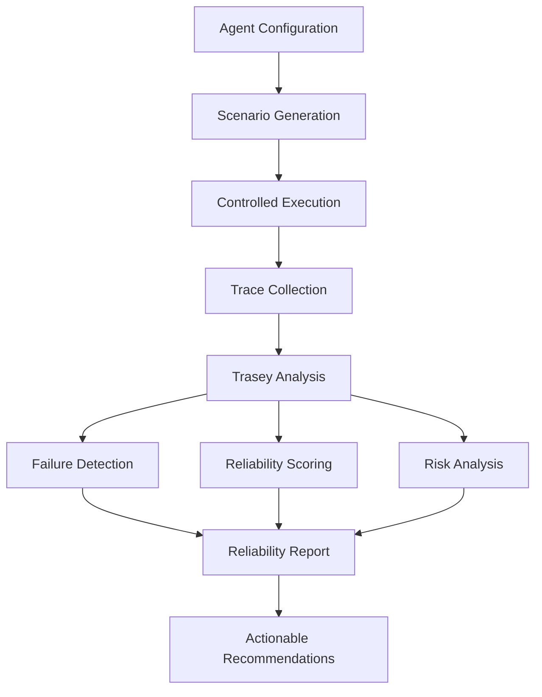

<p align="center">
  
</p>

<h1 align="center">ZeroTrace</h1>

<p align="center">
  <strong>Making Autonomous AI Agents Reliable, Explainable & Predictable</strong>
</p>

<p align="center">
  ZeroTrace evaluates how autonomous agents reason, use tools, recover from errors, and complete tasks—not merely what they say at the end.
</p>

<p align="center">
  <a href="<LIVE_DEMO_URL>">Live Demo</a>
  ·
  <a href="#-how-zerotrace-works">Architecture</a>
  ·
  <a href="#-getting-started">Getting Started</a>
  ·
  <a href="#-api-overview">API</a>
  ·
  <a href="#-meet-the-team">Team</a>
</p>

<p align="center">
  
  
  
  
  
</p>

<p align="center">
  
</p>

> **Agents should fail inside the test environment—not for the first time in front of users.**

<p align="center">
  
</p>

> [!NOTE]
> Replace image, deployment, repository, technology, and developer placeholders before submission. The metrics and terminal output below are illustrative unless connected to actual evaluation results.

---

## Quick Navigation

- [The Problem](#-the-problem)
- [Introducing ZeroTrace](#-introducing-zerotrace)
- [Meet Trasey](#-meet-trasey)
- [How It Works](#-how-zerotrace-works)
- [Key Features](#-key-features)
- [Failure Modes](#-failure-modes)
- [Reliability Report](#-reliability-report)
- [Technology Stack](#-technology-stack)
- [Getting Started](#-getting-started)
- [API Overview](#-api-overview)
- [Roadmap](#-roadmap)
- [Meet the Team](#-meet-the-team)

---

## ◈ The Problem

Autonomous AI agents do more than generate text. They plan multi-step tasks, select tools, call external APIs, modify systems, and make decisions with real consequences.

Traditional tests often inspect only the final answer:

```text
Prompt → Agent → Final Answer → Pass / Fail
````

A convincing answer can still hide a broken execution journey:

* The wrong tool may have been selected.
* A destructive operation may have been attempted.
* The agent may have looped before reaching the result.
* Claims may be unsupported despite confident wording.
* Only part of the requested task may have been completed.
* The original goal may have silently changed.

ZeroTrace inspects what happens between the prompt and the final response:

```text
Scenario
   ↓
Agent Execution
   ↓
Complete Trace
   ↓
Trasey
   ↓
Failure Analysis
   ↓
Reliability Intelligence
```

It brings the philosophy of **continuous integration** to autonomous AI agents.

---

## ◆ Introducing ZeroTrace

**ZeroTrace** is an AI-powered evaluation and reliability platform designed to test autonomous agents before deployment.

It generates realistic and adversarial scenarios, evaluates agent behavior in a controlled environment, analyzes execution traces, classifies failure modes, calculates reliability metrics, and turns detected weaknesses into developer-focused recommendations.

<p align="center">
  <strong>Trace → Test → Evaluate → Diagnose → Predict → Improve</strong>
</p>

ZeroTrace moves agent testing beyond “Did it produce the correct answer?” toward deeper engineering questions:

* Did the agent complete the actual objective?
* Did it use the correct tools safely?
* Where did the execution begin to fail?
* Is the behavior repeatable across similar scenarios?
* What should the developer change before deployment?

---

## ⚡ Meet Trasey

<p align="center">
  
</p>

**Trasey** is the evaluation intelligence at the center of ZeroTrace—an AI reliability engineer for autonomous agents.

Trasey examines the complete execution trajectory and transforms raw traces into understandable reliability intelligence.

| Trasey’s responsibility     | What it produces                                                    |
| --------------------------- | ------------------------------------------------------------------- |
| Execution analysis          | A structured view of decisions, steps, and tool interactions        |
| Task-completion evaluation  | Evidence of full, partial, or failed completion                     |
| Abnormal-behavior detection | Loops, drift, unsafe actions, inefficiency, and inconsistencies     |
| Failure classification      | Failure type, severity, location, and supporting evidence           |
| Root-cause diagnosis        | An explanation of where and why the execution failed                |
| Reliability measurement     | Interpretable scores across success, safety, consistency, and tools |
| Risk-pattern analysis       | Potential weaknesses and recurring failure patterns                 |
| Recommendations             | Concrete improvements for prompts, tools, policies, and workflows   |

> Trasey does not merely declare that an agent failed. It explains the execution path that produced the failure and what can be improved.

---

## ◈ How ZeroTrace Works



### Evaluation lifecycle

1. **Configure the agent**
   Provide the agent instructions, available tools, task domain, and evaluation settings.

2. **Generate scenarios**
   Produce realistic, edge-case, and adversarial tasks relevant to the agent.

3. **Run controlled evaluations**
   Execute each scenario within the configured evaluation environment.

4. **Capture the trajectory**
   Record agent actions, tool calls, outcomes, errors, timing, and task progress.

5. **Analyze with Trasey**
   Inspect the trace for success signals, failure modes, unsafe behavior, and inconsistencies.

6. **Calculate reliability**
   Convert evaluation evidence into understandable reliability and risk metrics.

7. **Generate recommendations**
   Provide practical guidance for improving prompts, tools, policies, and execution logic.

---

## ◆ Key Features

> **Implementation status:** Replace each `<STATUS>` value with `Implemented`, `Experimental`, or `Roadmap` based on the current repository.

| Capability                     | Description                                                                                                         | Status     |
| ------------------------------ | ------------------------------------------------------------------------------------------------------------------- | ---------- |
| **Scenario Generation Engine** | Generates realistic, edge-case, and adversarial scenarios based on an agent’s tools, instructions, and task domain. | `<STATUS>` |
| **Controlled Execution**       | Runs evaluation scenarios within an isolated or controlled execution layer.                                         | `<STATUS>` |
| **Execution Tracing**          | Captures agent actions, decisions, tool interactions, outputs, failures, and timing data.                           | `<STATUS>` |
| **Failure Detection**          | Detects problematic behavior across the complete execution trajectory.                                              | `<STATUS>` |
| **Root-Cause Analysis**        | Identifies the step where failure emerged and explains the contributing behavior.                                   | `<STATUS>` |
| **Reliability Scoring**        | Converts evaluation results into understandable success, safety, consistency, and tool-use metrics.                 | `<STATUS>` |
| **Failure-Risk Analysis**      | Identifies recurring weaknesses and estimates potential failure patterns.                                           | `<STATUS>` |
| **Actionable Recommendations** | Suggests concrete changes to prompts, tool constraints, policies, or agent workflows.                               | `<STATUS>` |

---

## ⚠ Failure Modes

| Failure mode                | What ZeroTrace looks for                                           |
| --------------------------- | ------------------------------------------------------------------ |
| **Tool Misuse**             | Incorrect, unnecessary, or poorly parameterized tool calls         |
| **Tool Loop**               | Repeated tool execution without meaningful progress                |
| **Goal Drift**              | Deviation from the user’s original objective                       |
| **Hallucination**           | Unsupported, fabricated, or unverifiable claims                    |
| **Unsafe Action**           | Potentially harmful, destructive, or unauthorized operations       |
| **Partial Completion**      | Termination before every required objective is completed           |
| **Overconfidence**          | Strong certainty despite weak or contradictory evidence            |
| **Inefficiency**            | Excessive steps, tokens, latency, retries, or tool calls           |
| **Reasoning Inconsistency** | Actions that conflict with earlier decisions or available evidence |
| **Silent Failure**          | Errors or missing results presented as successful completion       |
| **Recovery Failure**        | Inability to adapt after a tool, API, or reasoning error           |
| **Policy Violation**        | Behavior outside configured safety or evaluation constraints       |

---

## ◈ Reliability Report

ZeroTrace converts complex execution data into a report developers can quickly inspect and act upon.

```text
ZEROTRACE RELIABILITY REPORT
────────────────────────────────────────

Agent              ResearchAgent
Scenarios Tested   24

Reliability        87 / 100
Task Success       91%
Tool Accuracy      94%
Consistency        83%
Safety             96%

Risk Level         LOW

Most Common Failure
→ Tool selection under ambiguous requests

Failure Location
→ Scenario 14 · Execution Step 07

Trasey's Recommendation
→ Add explicit tool-selection constraints
  for ambiguous information requests.

────────────────────────────────────────
Evaluation complete.
```

> The values above are illustrative and must not be treated as results from a real evaluation run.

### Example terminal experience

```console
$ zerotrace evaluate research-agent

◈ Loading agent configuration...
◈ Generating adversarial scenarios...
◈ Running controlled evaluation...
◈ Tracing tool interactions...
◈ Analyzing execution with Trasey...

⚠ Failure detected
  Type        Tool Selection Error
  Step        07
  Severity    High

◆ Reliability Score   82/100
◆ Failure Risk        Medium

Trasey → Evaluation complete.
```

---

## ◆ Dashboard Preview

Add actual application screenshots to the `assets/` directory using the following names:

### Evaluation Dashboard


### Evaluation Run


### Trace Visualization


### Trasey Analysis


### Reliability Report


> [!IMPORTANT]
> These paths are screenshot placeholders. Add genuine product screenshots instead of generated or misleading UI images.

---

## ◈ Technology Stack

| Layer           | Technology                                   |
| --------------- | -------------------------------------------- |
| Frontend        | React, Vite                                  |
| Backend         | FastAPI, Python                              |
| AI Layer        | `<LLM_PROVIDER_OR_MODEL>`                    |
| API             | REST                                         |
| Database        | `<DATABASE>`                                 |
| Evaluation      | ZeroTrace Evaluation Engine                  |
| AI Evaluator    | Trasey                                       |
| Deployment      | `<FRONTEND_PLATFORM>` / `<BACKEND_PLATFORM>` |
| Version Control | Git, GitHub                                  |

<details>
<summary><strong>Why this architecture?</strong></summary>

* **React and Vite** support a fast, interactive evaluation dashboard.
* **FastAPI** provides typed, asynchronous API development for evaluation workflows.
* The **evaluation engine** separates scenario execution from reliability analysis.
* **Trasey** converts trace data into diagnoses, scores, risk patterns, and recommendations.
* A separate persistence layer can retain agents, scenarios, traces, evaluations, and reports.

</details>

---

## ◆ Repository Structure

> Update this tree to match the final repository before submission.

```text
ZeroTrace/
├── frontend/
│   ├── public/
│   └── src/
│       ├── components/
│       ├── pages/
│       ├── services/
│       └── assets/
│
├── backend/
│   ├── app/
│   ├── agents/
│   │   └── trasey/
│   ├── evaluation/
│   ├── tracing/
│   ├── database/
│   └── api/
│
├── tests/
├── docs/
├── assets/
│   ├── zerotrace-logo.png
│   ├── dashboard.png
│   ├── evaluation-run.png
│   ├── trace-visualization.png
│   ├── trasey-analysis.png
│   └── reliability-report.png
│
├── .env.example
├── LICENSE
└── README.md
```

---

## ⚡ Getting Started

### Prerequisites

Ensure the following are installed:

* Git
* Python `<PYTHON_VERSION>`
* Node.js `<NODE_VERSION>`
* npm

### 1. Clone the repository

```bash
git clone <REPOSITORY_URL>
cd ZeroTrace
```

### 2. Start the backend

```bash
cd backend
python -m venv venv
```

Activate the virtual environment:

**Windows PowerShell**

```powershell
.\venv\Scripts\Activate.ps1
```

**Windows Command Prompt**

```cmd
venv\Scripts\activate
```

**macOS/Linux**

```bash
source venv/bin/activate
```

Install the dependencies:

```bash
pip install -r requirements.txt
```

Create the environment file:

```bash
cp .env.example .env
```

On Windows Command Prompt:

```cmd
copy .env.example .env
```

Start the API:

```bash
<BACKEND_START_COMMAND>
```

Example only—use this if the FastAPI application is defined as `app` inside `backend/app/main.py`:

```bash
python -m uvicorn app.main:app --reload --port 8000
```

### 3. Start the frontend

Open another terminal:

```bash
cd frontend
npm install
npm run dev
```

Open the local URL printed by Vite, commonly:

```text
http://localhost:5173
```

---

## ◆ Environment Variables

Create a `.env` file from `.env.example`.

```env
# Application
APP_ENV=development
APP_NAME=ZeroTrace

# AI provider
<AI_API_KEY_NAME>=your_api_key_here
<AI_MODEL_VARIABLE>=your_model_here

# Database
DATABASE_URL=your_database_url_here

# Frontend/API connection
FRONTEND_URL=http://localhost:5173
API_URL=http://localhost:8000

# Authentication — include only if implemented
<SECRET_KEY_NAME>=replace_with_a_long_random_secret
```

> [!CAUTION]
> Never commit `.env`, API keys, database credentials, access tokens, or production secrets.

---

## ◈ API Overview

> Replace this section with endpoints verified against the backend implementation.

| Method | Endpoint                     | Purpose                       |
| ------ | ---------------------------- | ----------------------------- |
| `POST` | `<EVALUATE_ENDPOINT>`        | Start an agent evaluation     |
| `GET`  | `<EVALUATION_ENDPOINT>/{id}` | Retrieve an evaluation run    |
| `GET`  | `<TRACE_ENDPOINT>/{id}`      | Retrieve an execution trace   |
| `GET`  | `<REPORT_ENDPOINT>/{id}`     | Retrieve a reliability report |
| `GET`  | `<HEALTH_ENDPOINT>`          | Check API health              |

<details>
<summary><strong>Example evaluation request</strong></summary>

```json
{
  "agent_id": "<AGENT_ID>",
  "scenario_count": 10,
  "evaluation_mode": "adversarial"
}
```

The payload above is illustrative. Update it to match the actual API schema.

</details>

API base URL:

```text
<API_URL>
```

Interactive FastAPI documentation, if enabled:

```text
<API_URL>/docs
```

---

## ◆ Why ZeroTrace Is Different

```text
Final-output testing
        ↓
Execution-level reliability intelligence
```

| Conventional testing                 | ZeroTrace approach                                       |
| ------------------------------------ | -------------------------------------------------------- |
| Checks the final response            | Inspects the complete agent trajectory                   |
| Uses a few manually written prompts  | Supports realistic, edge-case, and adversarial scenarios |
| Returns pass or fail                 | Classifies failures with severity and evidence           |
| Hides the origin of failure          | Locates the step and explains the root cause             |
| Provides limited reliability context | Measures success, safety, consistency, and tool behavior |
| Leaves developers to diagnose issues | Produces developer-focused recommendations               |

ZeroTrace treats an agent as an executing system—not simply a text generator.

---

## ◈ Roadmap

Planned directions must remain clearly separated from implemented capabilities.

* [ ] Expand the adversarial scenario library
* [ ] Add multi-agent evaluation
* [ ] Support custom evaluation policies and scoring weights
* [ ] Introduce CI/CD pipeline integration
* [ ] Add automated regression testing
* [ ] Build historical reliability analytics
* [ ] Support side-by-side agent comparison
* [ ] Add real-time production monitoring
* [ ] Introduce configurable reliability gates
* [ ] Export reports in shareable formats
* [ ] Add evaluation templates for common agent domains
* [ ] Detect cross-run failure patterns

---

## ◆ Meet the Team

<table>
  <tr>
    <td align="center" width="33%">
      
      <br />
      <strong>&lt;DEVELOPER_01_NAME&gt;</strong>
      <br />
      <sub>Architecture · Frontend · Integration · Repository</sub>
      <br /><br />
      <a href="<DEVELOPER_01_GITHUB>">GitHub</a>
      ·
      <a href="<DEVELOPER_01_LINKEDIN>">LinkedIn</a>
      <br />
      <a href="mailto:<DEVELOPER_01_EMAIL>">Email</a>
    </td>
    <td align="center" width="33%">
      
      <br />
      <strong>&lt;DEVELOPER_02_NAME&gt;</strong>
      <br />
      <sub>Backend · Database · Deployment · Documentation</sub>
      <br /><br />
      <a href="<DEVELOPER_02_GITHUB>">GitHub</a>
      ·
      <a href="<DEVELOPER_02_LINKEDIN>">LinkedIn</a>
      <br />
      <a href="mailto:<DEVELOPER_02_EMAIL>">Email</a>
    </td>
    <td align="center" width="33%">
      
      <br />
      <strong>&lt;DEVELOPER_03_NAME&gt;</strong>
      <br />
      <sub>Testing · Repository Supervision · Branding · MVP Validation</sub>
      <br /><br />
      <a href="<DEVELOPER_03_GITHUB>">GitHub</a>
      ·
      <a href="<DEVELOPER_03_LINKEDIN>">LinkedIn</a>
      <br />
      <a href="mailto:<DEVELOPER_03_EMAIL>">Email</a>
    </td>
  </tr>
</table>

---

## ◈ Contributing

Contributions, bug reports, and improvement ideas are welcome.

1. Fork the repository.

2. Create a focused feature branch:

   ```bash
   git checkout -b feature/your-feature-name
   ```

3. Make and test your changes.

4. Commit with a clear message:

   ```bash
   git commit -m "feat: add your feature"
   ```

5. Push the branch:

   ```bash
   git push origin feature/your-feature-name
   ```

6. Open a pull request describing:

   * What changed
   * Why it was needed
   * How it was tested

Please avoid committing credentials, generated secrets, dependency folders, or unrelated changes.

---

## ◆ License

This project is distributed under the `<LICENSE_NAME>`.

See [`LICENSE`](./LICENSE) for the complete terms.

> Add an actual license file and replace `<LICENSE_NAME>` before publishing the repository.

---

## ⚡ Final Thought

<p align="center">
  <strong>Reliable agents are engineered through evidence—not trusted through confident outputs.</strong>
</p>

<p align="center">
  Built with ⚡ for safer, more reliable autonomous AI.
</p>

<p align="center">
  <a href="<LIVE_DEMO_URL>">Explore ZeroTrace</a>
  ·
  <a href="<REPOSITORY_URL>/issues">Report an Issue</a>
  ·
  <a href="<REPOSITORY_URL>/discussions">Start a Discussion</a>
</p>
```
